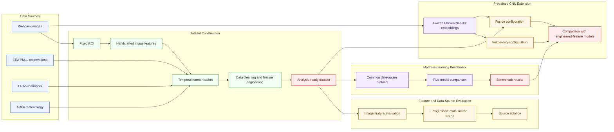

# Air Quality from Webcam Images: A Multi-Source PM₂.₅ Benchmark

### An open and reproducible benchmark for webcam-based image features, multi-source data fusion, conventional machine-learning models, and pretrained CNN representations

This repository contains an end-to-end workflow for estimating PM₂.₅ from fixed-camera outdoor images and complementary environmental data. It covers automated data acquisition, preprocessing, fixed-ROI image-feature extraction, multi-source evaluation, machine-learning benchmarking, and a pretrained CNN extension.

The project combines four primary data sources:

- fixed-view webcam imagery and image-derived visual features;
- PM₂.₅ observations from EEA monitoring stations;
- ERA5 meteorological reanalysis variables; and
- ARPA Lombardia ground meteorological observations.

Temporal predictors are derived during dataset development to represent diurnal
and seasonal structure. All model comparisons use the same predictor definitions,
date-aware data partitions, and evaluation metrics: MAE, RMSE, R², MAPE, SMAPE,
and NRMSE.

---

# Overall Workflow



The workflow links dataset construction with a sequence of complementary
evaluation stages. Webcam imagery, PM₂.₅ observations, ERA5 reanalysis, and
ARPA meteorological observations are first processed into a harmonised,
analysis-ready dataset through fixed-ROI extraction, temporal harmonisation,
data cleaning, and feature engineering.

The resulting dataset is then used for image-feature and data-source evaluation,
including progressive multi-source fusion and source ablation. A common
date-aware protocol is subsequently applied to benchmark five engineered-feature
models. Finally, the workflow includes a focused pretrained CNN extension based
on frozen EfficientNet-B0 image representations, with image-only and fused
configurations compared against the engineered-feature benchmark.

Across these stages, predictor definitions, data partitions, validation folds,
and evaluation metrics are kept consistent whenever the experimental objective
permits. This structure connects data preparation, controlled model comparison,
and reproducible evaluation within a single benchmark workflow.

---

# Research Questions

- **RQ1:** Can handcrafted ROI image features effectively represent PM2.5 variations?
- **RQ2:** Does combining image, environmental, monitoring, and temporal predictors improve PM2.5 estimation compared with using image features alone?
- **RQ3:** How accurately do conventional machine-learning models and a feature-based neural network estimate PM2.5 under a common benchmark protocol?
- **RQ4:** Can pretrained CNN representations from raw ROI images achieve competitive PM2.5 estimation performance compared with handcrafted image features?
- **RQ5:** Does combining learned image representations with environmental and temporal predictors improve performance over image representations alone?

---

# Repository Structure

```text
webcam-pm25-benchmark/
├── .github/
│   └── workflows/
│       └── webcam.yml
├── config/
│   └── roi.json
├── data/
│   ├── raw/                  # Local raw data; full content is not committed
│   ├── interim/              # Complete intermediate datasets
│   └── processed/            # Final analysis-ready dataset
├── notebooks/
│   ├── 01_webcam_pm25_dataset_pipeline.ipynb
│   ├── 02_dataset_cleaning_preprocessing.ipynb
│   ├── 03_image_features_and_multisource_data_evaluation.ipynb
│   ├── 04_machine_learning_model_benchmark.ipynb
│   └── 05_deep_learning_model.ipynb
├── results/
│   ├── feature_evaluation/
│   ├── model_benchmark/
│   └── deep_learning/
├── src/
│   ├── data/
│   │   ├── arpa.py
│   │   ├── era5.py
│   │   ├── integration.py
│   │   ├── pm25.py
│   │   └── webcam.py
│   ├── vision/
│   │   ├── handcrafted.py
│   │   └── roi.py
│   ├── features/
│   │   ├── evaluation.py
│   │   └── plots.py
│   ├── models/
│   │   ├── benchmark.py
│   │   └── plots.py
│   ├── deep_learning/
│   │   ├── embeddings.py
│   │   ├── models.py
│   │   └── training.py
│   └── config.py
├── .gitignore
├── LICENSE
├── README.md
└── requirements.txt
```

---

# Data Availability

The repository includes the intermediate and processed datasets required for the
feature evaluation and conventional model benchmark.

The final analysis dataset contains 3,625 hourly observations, 55 predictor
variables, and 209 independent dates. The predictors comprise handcrafted image
features, ARPA observations, ERA5 variables, and derived temporal variables.

```text
data/interim/
data/processed/
```

The complete raw webcam image archive is not committed to the repository because of its size. It is stored separately on Google Drive and is publicly accessible here:

[Webcam Image Archive (Google Drive)](https://drive.google.com/drive/folders/1sUjlPimVWVhaKdo9CWsO0uQVuJK8V2J6?usp=drive_link)

After downloading, place the images in:

```text
data/raw/images/
```

The expected image filenames use timestamps such as:

```text
20250327-1200.jpg
```

The raw webcam images are used for ROI inspection, handcrafted image-feature extraction, dataset construction, and pretrained CNN representation learning.

Other raw data sources are not fully committed to the repository. EEA PM₂.₅ and
ERA5 data can be retrieved through the corresponding data-access procedures, while
the ARPA Lombardia meteorological source files must be supplied separately.

Availability by entry point:

| Starting point | Repository data sufficient? | Additional requirements |
| -------------- | --------------------------: | ----------------------- |
| Dataset-construction pipeline | No | Raw webcam images, ARPA source files, network access, and CDS API configuration |
| Dataset cleaning | Yes | `data/interim/merged_dataset.csv` |
| Feature and data-source evaluation | Yes | `data/processed/final_dataset.csv` |
| Machine-learning benchmark | Yes | `data/processed/final_dataset.csv` |
| Pretrained CNN extension | No | Raw webcam images and the benchmark export |

---

# Installation

Clone the repository:

```bash
git clone https://github.com/QingxuanTuo/webcam-pm25-benchmark.git
cd webcam-pm25-benchmark
```

Create and activate a virtual environment:

```bash
python -m venv .venv
source .venv/bin/activate
```

On Windows, activate it with:

```powershell
.venv\Scripts\activate
```

Install the dependencies and start JupyterLab:

```bash
python -m pip install --upgrade pip
python -m pip install -r requirements.txt
jupyter lab
```

Run Jupyter from either the project root or `notebooks/`. The notebooks automatically locate the nearest parent directory containing both `src/` and `notebooks/`. Ensure that the selected Jupyter kernel uses the project `.venv` environment.

## Google Colab

The notebooks are Colab-compatible when the repository code and required data are cloned or mounted in the Colab environment. Notebook 01 mounts Google Drive and expects the full webcam image directory at:

```text
/content/drive/MyDrive/webcam_images
```

The repository itself must still be available in the current directory or one of its parent directories so that the notebooks can locate `src/`.

## ERA5 CDS API Configuration

ERA5 downloading requires a Copernicus Climate Data Store account. Follow the official [CDS API setup instructions](https://cds.climate.copernicus.eu/how-to-api), accept the applicable dataset Terms of Use, and create a `.cdsapirc` file in your home directory.

Windows:

```text
C:\Users\YOUR_USERNAME\.cdsapirc
```

Linux/macOS:

```text
~/.cdsapirc
```

Current configuration format:

```text
url: https://cds.climate.copernicus.eu/api
key: <PERSONAL-ACCESS-TOKEN>
```

---

# Automated Webcam Collection

Webcam images are collected from the Milan webcam platform using the scheduled GitHub Actions workflow defined in:

```text
.github/workflows/webcam.yml
```

The download script is located at:

```text
src/data/webcam.py
```

The workflow downloads timestamped webcam images and uploads them to Google Drive
using the repository's configured `RCLONE_CONF` secret. It can also be triggered
manually from:

```text
Actions -> webcam download -> Run workflow
```

---

# Quick Start

The complete workflow follows this order:

```text
Dataset construction
    -> Image-feature and multi-source evaluation
    -> Machine-learning benchmark
    -> Pretrained CNN extension
```

Because the intermediate and processed datasets are provided, users interested
only in evaluation can start from the processed dataset. The pretrained CNN
extension additionally requires the raw webcam image archive and the engineered-
feature benchmark export.

## 1. Webcam PM2.5 Dataset Pipeline

```text
notebooks/01_webcam_pm25_dataset_pipeline.ipynb
```

Performs:

- ROI selection and visual inspection;
- handcrafted image feature extraction;
- PM2.5 downloading and processing;
- ERA5 downloading and processing;
- ARPA Lombardia data merging; and
- multi-source dataset integration.

Main outputs:

```text
data/interim/image_features.csv
data/interim/era5_all_merged.csv
data/interim/arpa_merged.csv
data/interim/merged_dataset.csv
```

## 2. Dataset Cleaning and Preprocessing

```text
notebooks/02_dataset_cleaning_preprocessing.ipynb
```

Performs data profiling, missing-value handling, cleaning, feature engineering, temporal validation, and final dataset generation.

Main output:

```text
data/processed/final_dataset.csv
```

## 3. Image Features and Multi-Source Data Evaluation

```text
notebooks/03_image_features_and_multisource_data_evaluation.ipynb
```

Evaluates handcrafted ROI image features and the incremental contribution of ERA5, ARPA, and temporal predictors. The models in this notebook are analytical tools for feature and data-source evaluation.

Main output directory:

```text
results/feature_evaluation/
```

## 4. Machine-Learning Model Benchmark

```text
notebooks/04_machine_learning_model_benchmark.ipynb
```

Benchmarks five engineered-feature models under a common, date-aware evaluation
protocol and exports the comparison used by the pretrained CNN extension.

Required benchmark output for the pretrained CNN extension:

```text
results/model_benchmark/traditional_model_benchmark_results.csv
```

## 5. Pretrained CNN Extension

```text
notebooks/05_deep_learning_model.ipynb
```

Evaluates two prespecified configurations: Frozen EfficientNet Image Only and Frozen EfficientNet Fusion. EfficientNet-B0 is used as a frozen feature extractor rather than as part of a broad CNN architecture benchmark.

Required inputs:

```text
data/processed/final_dataset.csv
data/interim/image_features.csv
config/roi.json
data/raw/images/
results/model_benchmark/traditional_model_benchmark_results.csv
```

Main output directory:

```text
results/deep_learning/
```

Embedding caches are generated automatically when absent. Generated `.npz`
embedding caches and `.pt` model files are excluded from Git, while the result
tables and figures remain available.

---

# Generated Datasets

| Dataset | Description |
|---|---|
| `data/interim/image_features.csv` | Timestamped ROI-based handcrafted image features and image paths |
| `data/interim/era5_all_merged.csv` | Processed ERA5 meteorological variables |
| `data/interim/arpa_merged.csv` | Processed ARPA Lombardia ground observations |
| `data/interim/merged_dataset.csv` | Integrated multi-source environmental dataset |
| `data/processed/final_dataset.csv` | Cleaned, feature-engineered, analysis-ready dataset |

---

# Repository Outputs

The repository retains the principal CSV tables and PNG figures generated by the evaluation notebooks:

```text
results/
├── feature_evaluation/   # Image-feature and multi-source evaluation
├── model_benchmark/      # Engineered-feature model benchmark
└── deep_learning/        # Pretrained CNN extension
```

These outputs include image-feature correlations, feature-group and multi-source
evaluations, date-grouped cross-validation and common hold-out results, model
benchmark comparisons, supplementary metrics (MAE, RMSE, R², MAPE, SMAPE, and
NRMSE), prediction diagnostics, and CNN configuration comparisons.

An independent external evaluation was conducted on a separate webcam dataset to
assess the reproducibility of the complete workflow under different camera and
environmental conditions. Detailed results are reported in the thesis.

---

# License

The source code in this repository is licensed under the [MIT License](LICENSE).

Third-party environmental data and webcam imagery are not covered by the MIT License and remain subject to the terms and licences of their respective providers.
